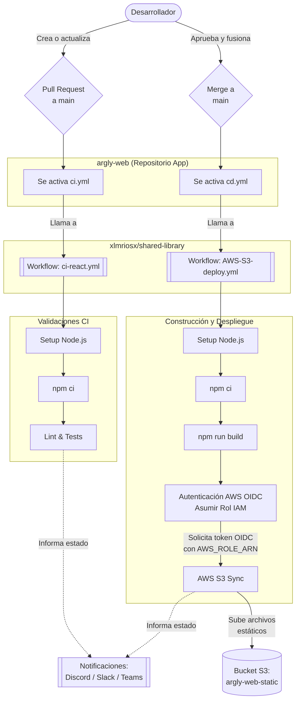

# Documentación de CI/CD (Integración y Despliegue Continuo)

Este documento describe el flujo completo de CI/CD para el proyecto **argly-web**, el cual utiliza GitHub Actions junto a una librería compartida de flujos de trabajo (*shared-library*).

## Diagrama de Flujo (Mermaid)

El siguiente diagrama ilustra cómo se integra y despliega el código:

## Explicación del Flujo

### 1. Integración Continua (CI)
- **Cuándo se ejecuta:** Cada vez que se crea un *Pull Request* hacia la rama `main` o se suben nuevos *commits* a un PR existente.
- **Flujo:** 
  1. El evento es capturado por el archivo local `.github/workflows/ci.yml`.
  2. Este archivo invoca al *reusable workflow* `ci-react.yml` que vive en el repositorio centralizado `xlmriosx/shared-library`.
  3. El workflow instala Node.js (v20), instala dependencias con caché (`npm ci`) y típicamente realiza validaciones estáticas (linters) y pruebas unitarias.
  4. Envía notificaciones de éxito o error al equipo mediante un webhook (ej. Discord).

### 2. Despliegue Continuo (CD)
- **Cuándo se ejecuta:** Al hacer `push` o aceptar un PR (hacer *Merge*) directamente en la rama `main`.
- **Flujo:**
  1. El evento es capturado por el archivo local `.github/workflows/cd.yml`.
  2. Invoca al *reusable workflow* `AWS-S3-deploy.yml` de la librería compartida.
  3. Prepara el entorno Node.js e instala dependencias (`npm ci`).
  4. Genera la versión de producción estática ejecutando `npm run build`.
  5. **Autenticación AWS (OIDC):** El workflow solicita un *token de identidad temporal* a GitHub y lo intercambia con AWS asumiendo el rol IAM (`github-actions-argly-web-deploy`) sin necesidad de llaves estáticas permanentes.
  6. **Sincronización:** Ejecuta el comando `aws s3 sync ./build s3://argly-web-static --delete` copiando el contenido construido al *Bucket de S3*.
  7. Notifica el estado final del despliegue (Discord, Teams o Slack).

## ¿Dónde se despliega?
El código se empaqueta como una aplicación estática (gracias al comando `build` de React/Next.js) y se sube al **bucket de AWS S3** denominado `argly-web-static`. El bucket aloja todos los archivos `.html`, `.js`, `.css` y dependencias (assets) que luego se sirven a la web.
